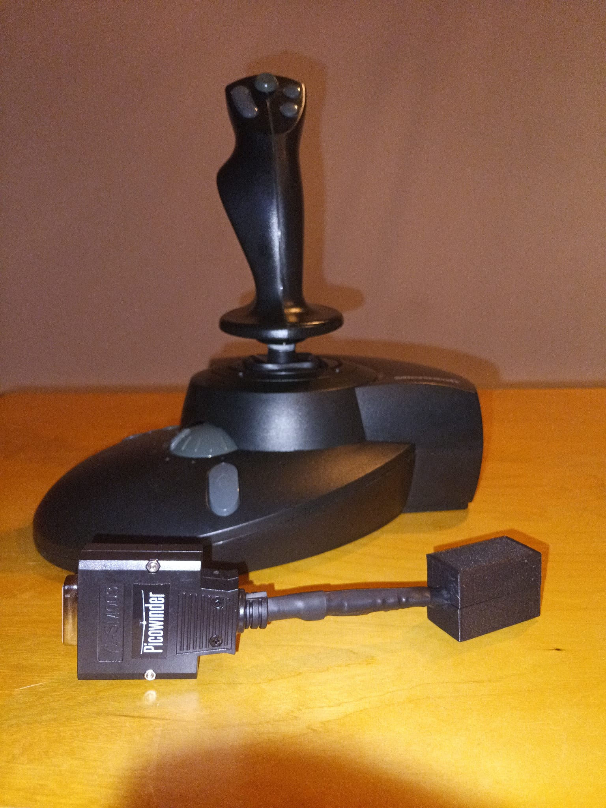
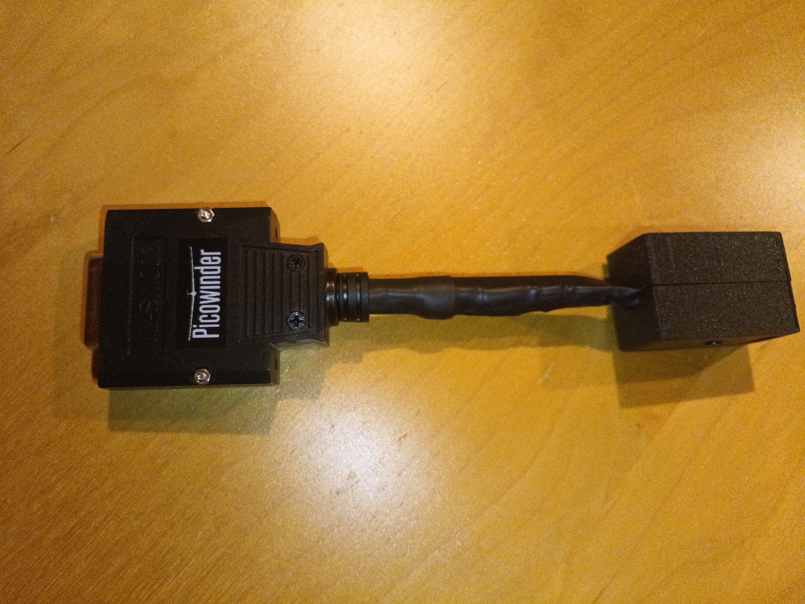
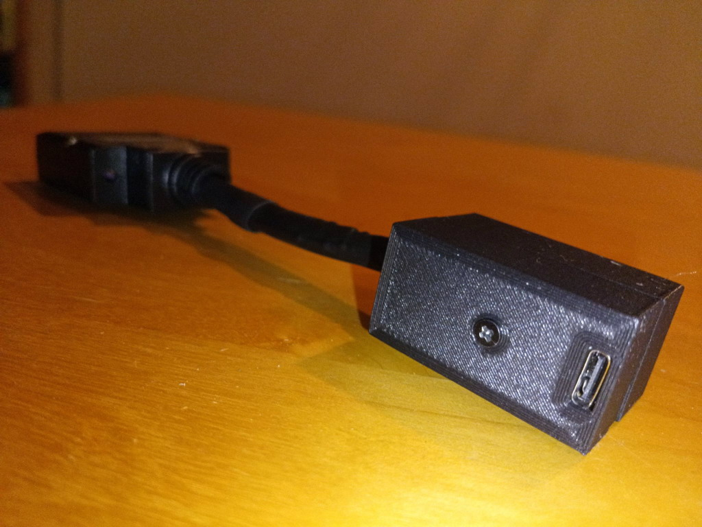

# PicoWinder FFB PRO — FINAL

USB firmware for the **Microsoft SideWinder Force Feedback Pro (Gameport)** using an RP2040 / RP2040-Zero.
<p align="center">
This project is based on Nolan Nicholson's original **PicoWinder** and continues that work with a large number of fixes and changes aimed at getting reliable joystick input and real DirectInput Force Feedback on **Windows 10 and Windows 11**.

It has been tested with standard DirectInput FFB tools and extensively tested with <a href="https://www.condorsoaring.com/"><strong>Condor 3</strong></a>.


  
</p>

<p align="center">
  <em>Microsoft SideWinder Force Feedback Pro Gameport with the PicoWinder FFB PRO RP2040 USB adapter.</em>
</p>

<p align="center">
  <strong>Would you like a ready-built PicoWinder FFB PRO adapter?</strong><br>
  Feel free to contact me at <a href="mailto:luckplat@duck.com">luckplat@duck.com</a>
</p>

---

## Why I made this

I originally had no intention of writing a new firmware.

The goal was simply to build the original PicoWinder adapter and use my SideWinder Force Feedback Pro on a current PC.

The joystick was detected by Windows and the basic controls worked, but the Force Feedback did not work reliably on my hardware. The same problems also appeared with generic DirectInput FFB test programs, so this was not just a Condor 3 compatibility problem.

Among the problems seen during testing:

* FFB could stop after a few seconds
* joystick input and FFB could freeze together
* a strong centering force could remain after a reset
* FFB often behaved mostly like a simple centering spring
* dynamic effects were weak, missing or unreliable

I also could not find a reproducible public example of the **unmodified upstream firmware**, with a clearly identified build, providing complete and stable DirectInput FFB on Windows 10/11.

So what started as troubleshooting gradually became a full debugging and validation project.

---

## What works

The FINAL firmware currently provides:

* SideWinder Force Feedback Pro Gameport → USB
* Windows 10 / 11 support
* USB HID joystick input
* X / Y axes
* throttle / slider
* Rotation Z / twist
* buttons and trigger
* approximately **1 kHz** input reporting
* stable DirectInput Force Feedback
* dynamic Spring effects
* periodic effects
* speed-dependent control resistance
* trim / moving equilibrium point
* stall buffet
* high-speed flutter
* clean FFB shutdown
* correct reset and native auto-center handling
* X/Y jitter filtering
* full-range throttle filtering
* smooth Rotation-Z filtering
* no FFB/input freeze observed in the final validation tests

USB Product Name:

**`Picowinder FFB PRO`**

---

## The adapter

The hardware itself is quite simple.

An **RP2040 / RP2040-Zero** sits between the original SideWinder Gameport connection and the PC.

<p align="center">
  
</p>

The SideWinder keeps its original electronics, motors and external power supply. The RP2040 handles communication between the old SideWinder protocol and USB HID / DirectInput PID.

<p align="center">
  
</p>

In my build the RP2040 is housed in a small enclosure and connects to the PC through USB-C.

---

## Force Feedback testing

Condor 3 became a very useful real-world test application because it continuously changes several Force Feedback parameters during flight.

USB captures showed Condor creating and updating:

* Spring effects
* periodic / Triangle effects
* effect gain
* Spring center position
* START / STOP operations

The final firmware transfers these correctly to the SideWinder.

### Control force

The stick is relatively light at low speed and becomes progressively heavier as airspeed increases.

### Trim

Trim actually moves the Spring equilibrium point.

This means the physical neutral position of the stick moves with trim instead of simply changing overall force.

### Stall buffet

Periodic effects become clearly noticeable close to the stall.

### Flutter

At high speed the periodic effects produce clearly noticeable flutter.

Condor 3 was one of the main applications used during development, but **PicoWinder FFB PRO is not specific to Condor**.

It implements standard **Windows DirectInput Force Feedback**, so other compatible applications can use it as well.

---

## Main fixes

This firmware was not the result of one big rewrite.

Most of the progress came from finding one specific problem, testing it, fixing it, and moving on to the next one.

The main areas changed were:

* native SideWinder auto-center after reset
* FFB effect-table handling
* blocking operations inside USB/HID callbacks
* asynchronous SideWinder communication
* post-reset stabilization
* SideWinder message pacing
* stale FFB effect IDs
* periodic-effect gain
* Spring response
* X/Y jitter
* throttle / slider filtering
* Rotation-Z filtering
* input-buffer concurrency

### Trigger kick / stale effect ID

One particularly difficult problem came from the original diagnostic trigger-kick effect.

After a device reset, the firmware could still remember the old effect ID while Windows or an application reused that same ID for another effect.

In Condor, for example, that ID could become the main Spring effect.

Pressing and releasing the trigger could then accidentally PLAY or PAUSE Condor's Spring and make the FFB appear to have died.

The artificial kick was removed completely.

### Reset and auto-center

A DirectInput reset could cause the SideWinder's own native centering force to become active again.

The final firmware disables it again after reset and waits briefly for the joystick to stabilize before continuing normal FFB communication.

### USB / SideWinder communication

FFB communication with the SideWinder is queued and asynchronous.

The USB side therefore does not have to stop and wait while commands are physically sent to the joystick.

SideWinder messages are also paced rather than sent continuously back-to-back. On the hardware tested here, this made a major improvement to stability.

### Periodic effects and Spring

Periodic-effect gain handling was corrected, which made effects such as stall buffet and flutter much easier to feel.

The Spring response was also reshaped so it would not overpower the other effects at low and medium force levels, while still allowing full force when required.

---

## Input stability

The original SideWinder controls have a small amount of raw jitter.

Instead of applying the same smoothing to every axis, the firmware uses different filtering for:

* X / Y
* throttle / slider
* Rotation Z

This keeps the controls stable without noticeably slowing them down or reducing their useful range.

USB input reporting in the final captures is approximately **1 kHz**.

---

## Firmware architecture

### Input path

```text
SideWinder Force Feedback Pro
        ↓
Gameport protocol
        ↓
RP2040 PIO / decoder
        ↓
RAW input report
        ↓
local snapshot + axis filtering
        ↓
USB HID
        ↓
Windows 10 / 11
```

### Force Feedback path

```text
Windows DirectInput PID
        ↓
USB HID OUTPUT / FEATURE
        ↓
FFB translation
        ↓
non-blocking FIFO
        ↓
SideWinder message pacing
        ↓
SideWinder protocol
        ↓
joystick motors
```

---

## Hardware

Target hardware:

* Microsoft **SideWinder Force Feedback Pro**
* Gameport / DA-15 version
* RP2040 or RP2040-Zero
* suitable DA-15 wiring
* original or compatible SideWinder external power supply

This project is for the **SideWinder Force Feedback Pro Gameport version**.

It is not intended for the later native-USB **SideWinder Force Feedback 2**, which does not need this type of Gameport-to-USB adapter.

Check the hardware documentation in this repository before wiring the adapter.

---

## Flashing

The ready-to-use firmware can be downloaded from the **FINAL GitHub Release**.

To flash it manually:

1. Connect the SideWinder / Gameport side of the adapter.
2. Hold **BOOTSEL** while connecting the RP2040 to USB.
3. The RP2040 appears as a USB mass-storage drive.
4. Copy:

   `firmware/PicoWinder_FFB_PRO_FINAL_A22.uf2`

   to the RP2040 drive.
5. The board reboots automatically.
6. Reconnect normally if needed.

Windows 10/11 should enumerate the device as:

**`Picowinder FFB PRO`**

Windows may keep an older cached device name. If that happens, removing the old device instance and reconnecting the adapter should refresh it.

### Firmware SHA-256

`49279876c95b18d4316cdd96e057593b9fdb733f064c0650adf3d5b9416b8103`

The public **FINAL** firmware corresponds internally to the validated **A22** development build.

---

## How it was tested

A lot of the development work was based on captures and binary checks rather than simply changing code until the joystick "felt better".

Tools used during development included:

* real SideWinder hardware
* DirectInput FFB test utilities
* Condor 3
* USBPcap
* Wireshark
* ELF symbol inspection
* linker-placement checks
* disassembly
* UF2 → RAW reconstruction
* binary comparison
* SHA-256 verification

The basic rule became:

**Change one thing at a time and test it.**

Several changes that looked sensible on paper were discarded because they caused regressions or because further testing showed that the original diagnosis was wrong.

---

## Source code

The final firmware was developed incrementally with wrappers and targeted binary patches.

It was **not** built from one single edited C project.

The repository therefore keeps several views of the source.

### `exact_rebuild/`

Contains what is needed to reproduce the exact physically tested FINAL firmware.

Use this path when exact binary reproducibility matters.

### `source/history/`

Contains the real C, ASM, linker and Python files created during development.

### `source/final_modules/`

Contains the final firmware logic split into readable modules.

### `source/clean_integrated_project/`

Contains a cleaner integrated C-source reconstruction intended as a starting point for future development.

A firmware compiled from this clean tree should be considered a **new firmware build** until it has been tested again on real hardware.

It should not automatically be assumed to behave exactly like the validated FINAL release.

---

## A note for future development

The current firmware is marked **FINAL because it works**.

Some parts may look tempting to simplify or rewrite, but many of them exist because a real problem was found during testing.

In particular, be careful when changing:

* SideWinder message pacing
* reset timing
* native auto-center handling
* DirectInput / PID semantics
* effect-table handling
* periodic gain
* Spring response
* axis filters
* USB/HID execution paths

If a new problem is found, the preferred approach is:

1. reproduce it
2. capture the USB traffic
3. identify where it actually fails
4. change one thing
5. compare before and after
6. verify the resulting binary
7. test it on a real SideWinder

A successful compile by itself does not mean the firmware is validated.

---

## Upstream project and credits

PicoWinder FFB PRO is based on the original **PicoWinder** project by **Nolan Nicholson**:

https://github.com/NolanNicholson/picowinder

The original project provided the RP2040 hardware interface, SideWinder communication and USB HID / PID foundation used here.

PicoWinder FFB PRO is a continuation of that work, not an unrelated project.

Full credit for the original PicoWinder project remains with Nolan Nicholson.

---

## License

The original PicoWinder project is licensed under the **GNU General Public License v3.0 (GPL-3.0)**.

This modified project is distributed under **GPL-3.0** as well.

Please preserve the upstream attribution and license when redistributing this project or modified versions of it.

---

## Status

### FINAL

The current firmware is the version I recommend for using a **Microsoft SideWinder Force Feedback Pro Gameport joystick on Windows 10/11 with DirectInput Force Feedback**.

For the complete development history and technical details, see:

* `docs/SOURCE_MAP.md`
* `CHANGELOG.md`
* `docs/MEGA_HANDOFF_FINAL_A22.txt`
* `exact_rebuild/`
* `source/history/`

---

*Microsoft and SideWinder are trademarks of Microsoft Corporation.*

*Condor is a trademark of its respective owner.*

*This is an independent open-source community project and is not affiliated with or endorsed by Microsoft, Condor, or the original PicoWinder author.*
